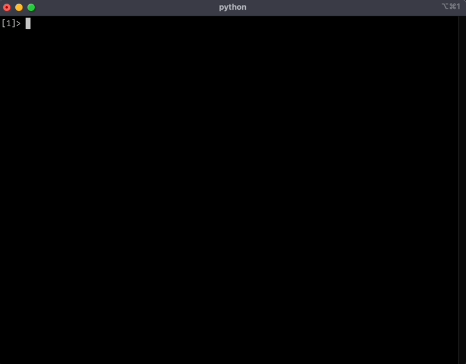

# Prerequisites
- Setup an account with OpenAI
- You'll need access to GPT-4 (minimum billing requirement with OpenAI)

# Setup
- set env variable OPENAI_API_KEY to your OpenAI developer key
- `pip install -r requirements.txt`

# Running
- `python chat.py`
- Type multiline queries into the prompt and two blank lines to submit
- `/help` for help

```
Enter a multi-line prompt
Enter two blank lines or '.' to process the prompt

commands:
/new or / - reset the history
/quit /exit /q - to exit
/paste - paste from clipboard
```

